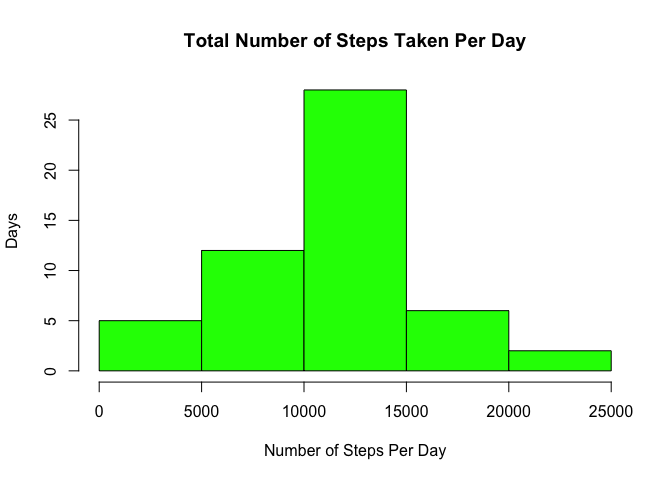

# Reproducible Research: Peer Assessment 1


### Load and process the data:

- Download and unzip the data file from https://d396qusza40orc.cloudfront.net/repdata%2Fdata%2Factivity.zip
- Set working directory

```r
library(knitr)
setwd("~/Documents/Coursera_Data_Science/05_Reprod_Research/1_Proj1")
data<- read.csv("activity.csv")
```

### Q1) What is the mean total number of steps taken per day?
Instructions:
- Ignore the missing values in the dataset.

####     1. Calculate the total number of steps taken per day

```r
data$date <- as.Date(data$date,"%Y-%m-%d")
Steps_per_day <- tapply(data$steps, data$date, sum)
```

####     2. Make a histogram of the total number of steps taken each day


```r
library(lattice)
hist(Steps_per_day, xlab="Number of Steps Per Day",ylab="Days", main="Total Number of Steps Taken Per Day", col="green")
```

 

####     3. Calculate and report the mean and median of the total number of steps taken per day

```r
mean(Steps_per_day,na.rm=TRUE)
```

```
## [1] 10766.19
```

```r
median(Steps_per_day,na.rm=TRUE)
```

```
## [1] 10765
```

### Q2) What is the average daily activity pattern?

Make a time series plot (i.e. type = "l") of the 5-minute interval (x-axis) and the average number of steps taken, averaged across all days (y-axis)

Which 5-minute interval, on average across all the days in the dataset, contains the maximum number of steps?


Calculate and report the total number of missing values in the dataset (i.e. the total number of rows with NAs)
